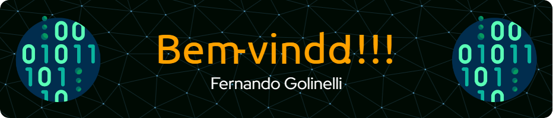

### Quem sou eu?

Me chamo Fernando Golinelli.

- 🔭 Hoje, desenvolvendo ambientes web em PHP, HTML, CSS e mySQL
- 🌱 E, estudando todos cursos da **[Formação Dev](https://escola.formacao.dev)** da **[Cod3r](https://www.cod3r.com.br)**
- 📫 Se quiser falar comigo, mande um e-mail para fernando@golinelli.eti.br com o assunto *__Te encontrei no Github__*

## Trabalhando com
     

## Aprendendo 
- React na **[Formação Dev](https://escola.formacao.dev)** da **[Cod3r](https://www.cod3r.com.br)**
- Javascript completão na **[Formação Dev](https://escola.formacao.dev)** da **[Cod3r](https://www.cod3r.com.br)**

## Já estudei
- Web Security na **[HackerSec](https://hackersec.com)**
- APGS na **[CCE PUC-Rio](https://cce.puc-rio.br)**
- ASP na **[CCE PUC-Rio](https://cce.puc-rio.br)**

## Já tive contato
 
          

<!--
**fgolinelli/fgolinelli** is a ✨ _special_ ✨ repository because its `README.md` (this file) appears on your GitHub profile.

Here are some ideas to get you started:

- 🔭 I’m currently working on ...
- 🌱 I’m currently learning ...
- 👯 I’m looking to collaborate on ...
- 🤔 I’m looking for help with ...
- 💬 Ask me about ...
- 📫 How to reach me: ...
- 😄 Pronouns: ...
- ⚡ Fun fact: ...
-->
